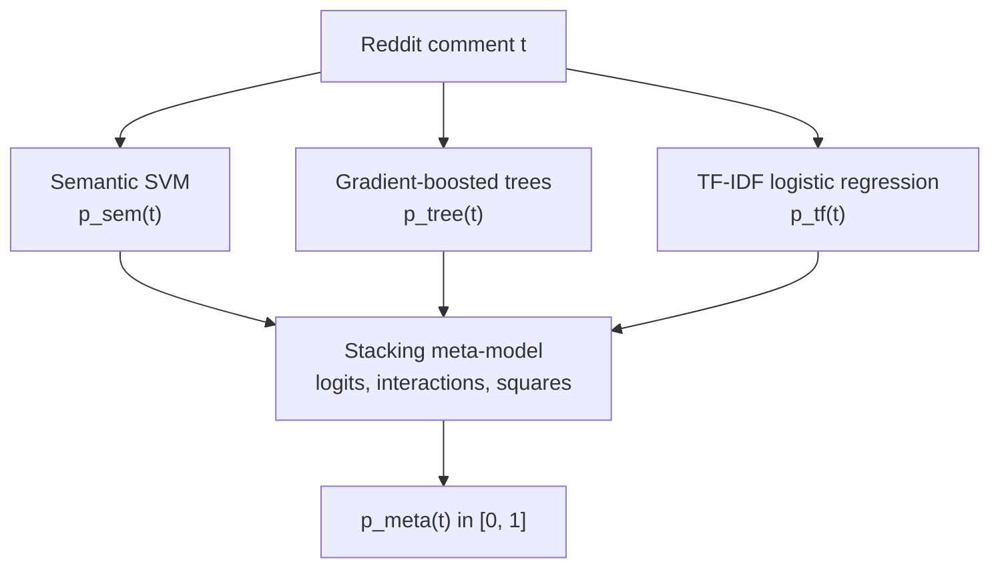
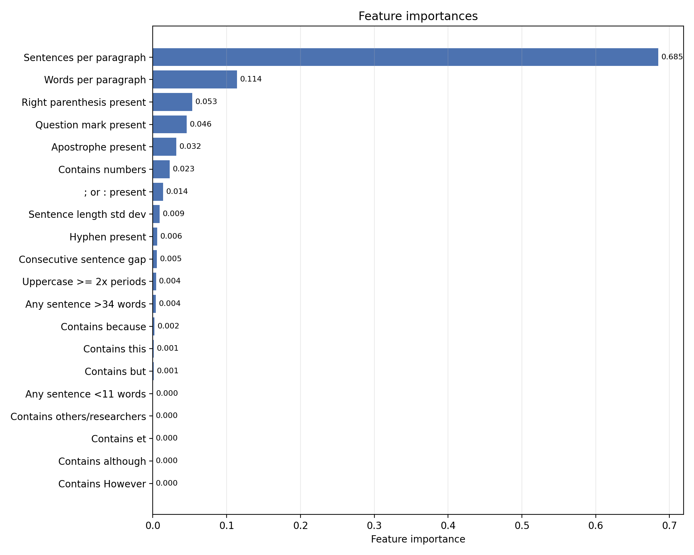

# Bots and How to Catch Them

> Estimating the probability that a Reddit comment was generated by a language model, from the text alone.\
> STEM Games 2026, Mathematics arena x Erste. Team ReinFERcement learning.\
> Authors: Roko Čubrić, Borna Gojšić, Petar Jadro, David Janjić

Bots account for 53% of web traffic against 47% human, and 40 points of that share are classified as bad-bot traffic [1]. A quadratic fit to the bad-bot series from 2013 to 2025 crosses 50% at 2027.6. The dip in the middle of that series is not a reversal: the 2014 spike came from mass vulnerability scanning after Heartbleed and Shellshock, and the fall after it from wider edge protection and better-behaved crawlers.

Bot detection normally works at the account level, on post counts, follower ratios, account age and profile credibility. This system uses none of those. The only input is the comment and the way it is written, and the output is not a claim about who owns an account, but a probability that this particular comment is AI-generated. Three subsystems read the same comment along three axes, and a stacking meta-model learns how to combine what they report.



Throughout, $y=1$ denotes the class `AI` and $y=0$ the class `HUMAN`, and every subsystem returns an estimate of $P(y=1 \mid t)$ rather than a hard label.

## Data

Three public sources were merged: `trentmkelly/gpt-slop-2` and `trentmkelly/gpt-slop` on HuggingFace, and the Reddit datasets from the [GriD](https://github.com/madlab-ucr/GriD/tree/main/reddit_datasets) repository. The merged set was shuffled before splitting, so that source order, temporal grouping and local patterns inside any one source do not survive the split. The split is 70-15-15:

```
train.csv  197,355 rows   100,669 HUMAN / 96,686 AI
dev.csv     42,289 rows    21,571 HUMAN / 20,718 AI
test.csv    42,292 rows    21,573 HUMAN / 20,719 AI
```

Every number reported below is measured on `dev.csv`, which is where the subsystems were compared against each other. `test.csv` was used once, at the end, for the final model only.

## Semantic view: calibrated linear SVM

The assumption behind this subsystem is that a large part of AI-generated comments differs not only in style but in purpose. Such comments are often shaped to raise engagement: to provoke, to deepen a political or ideological split, to sharpen an argument, to invite a chain of replies. The claim is not that every AI comment has that function, only that the signal is frequent enough to be worth modelling on its own.

The comment is embedded with `all-MiniLM-L6-v2` into $x \in \mathbb{R}^{384}$, then normalized and standardized coordinate-wise,

$$\hat{x} = \frac{x}{\lVert x \rVert_2}, \qquad z_j = \frac{\hat{x}_j - \mu_j}{\sigma_j}$$

so that vector length is removed first and the coordinate scales are matched second. A linear separator is a natural choice here precisely because of what came before it. The nonlinear part of the work has already been done by the embedding model, and the classifier no longer separates words but positions in a semantic space. The decision function is $f(z) = w^\top z + b$, the margin has width $2 / \lVert w \rVert_2$, and since real text is not separable, the soft-margin problem is solved,

$$\min_{w,b}\; \frac{1}{2}\lVert w \rVert_2^2 + C \sum_{i=1}^{n} \max\{0,\, 1 - \tilde y_i (w^\top z_i + b)\}$$

which is `LinearSVC` over the standardized embeddings, not a kernel solver. The dual picture explains which examples carry the boundary, but it is not a description of what runs in the code.

An SVM returns a signed distance $s = f(z)$ and not a probability, so Platt calibration is applied on top,

$$P(y=1 \mid s) \approx \frac{1}{1 + \exp(As + B)}$$

with $A$ and $B$ fitted by three-fold cross-calibration inside the training set: in each fold the base `LinearSVC` is trained on two thirds and the decision values used for fitting the sigmoid come from the held-out third, so the sigmoid is never fitted on the values the separator was just trained on. The final estimate averages the three calibrated probabilities.

Dev: accuracy 0.90948, precision 0.90341, recall 0.91283, $F_1$ 0.90810, ROC AUC 0.96885.

## Structural view: gradient-boosted trees

This subsystem asks a different question: not what the comment means, but how it is built. Each comment becomes a vector $x \in \mathbb{R}^{20}$ of sentence- and paragraph-level heuristics: sentences per paragraph, words per paragraph, presence of a closing parenthesis, hyphen, semicolon or colon, question mark and apostrophe, the standard deviation of sentence length, the mean gap between consecutive sentence lengths, presence of very short and very long sentences, and binary indicators for `although`, `however`, `but`, `because`, `this`, `others/researchers`, numbers and `et`.

These are not rules chosen in advance and then defended. Correlation with the AI label on the training set is highest for sentences per paragraph (0.495), question mark present (0.442), words per paragraph (0.414), `but` (0.362) and apostrophe (0.360). Negative correlations sit with semicolon or colon (-0.179), closing parenthesis (-0.163) and numeric references (-0.134), which is to say human comments hold on to some of the quieter punctuation that generated text drops.

The classifier is a `HistGradientBoostingClassifier` with `max_depth=5`, `learning_rate=0.06`, `max_iter=300` and `min_samples_leaf=15`, with early stopping on a held-out part of the training set, so that

$$F_M(x) = \beta_0 + \eta \sum_{m=1}^{M} T_m(x), \qquad p_{\mathrm{tree}}(x) = \frac{1}{1 + e^{-F_M(x)}}$$

A tree ensemble suits this feature set for two reasons. It models interactions directly, and a comment that is long is not the same signal as a comment that is long, full of question marks and highly variable in sentence length at once. It also compares against thresholds rather than distances, so the features do not have to be standardized the way the SVM inputs do.

Permutation importance concentrates on words per paragraph (0.1632) and sentences per paragraph (0.0873), then apostrophe (0.0182), question mark (0.0173), sentence-length standard deviation (0.0146) and consecutive-sentence gap (0.0089). The ranking agrees with the correlation analysis rather than contradicting it.



The repository also carries a single `DecisionTreeClassifier` mode. It is not there because it scores better, because it does not; it is there because it gives a literal root-to-leaf walk for one comment, a readable sequence of the form `sentences per paragraph > 2.595` and `question mark present`, which is what an explanation of a single decision has to look like.

Dev: accuracy 0.90487, balanced accuracy 0.90510, precision 0.89214, recall 0.91664, $F_1$ 0.90423, ROC AUC 0.96696.

## Lexical view: TF-IDF logistic regression

The third subsystem treats the comment as a character sequence and looks for local patterns. It uses neither a dense sentence embedding nor hand-specified structural features, and learns directly from words, word pairs and short character runs. Generated comments repeat characteristic phrases, transitions and punctuation habits, and those can be caught without any representation of meaning.

Two TF-IDF representations are combined in a `FeatureUnion`: word unigrams and bigrams, and character $n$-grams of length 3 to 5. Sublinear frequency scaling is on, so the weight of feature $g$ in comment $t$ is

$$\operatorname{tf}(t,g) = 1 + \log c_{t,g}, \qquad \operatorname{idf}(g) = \log\frac{1+N}{1+\operatorname{df}(g)} + 1$$

with the product L2-normalized afterwards. In the model saved for stacking, the word vocabulary holds 793,698 entries and the character vocabulary 763,983, for $d = 1{,}557{,}681$ sparse features in total. The dimension is large, but each comment activates a small part of it.

Over that vector a logistic regression is trained with L2 regularization and `class_weight=balanced`,

$$\min_w\; \sum_{i=1}^{n} \alpha_{y_i} \left[ -y_i \log p_i - (1-y_i)\log(1-p_i) \right] + \lambda \lVert w \rVert_2^2$$

The model stays linear in TF-IDF space, so a single coefficient states how far the presence of one $n$-gram moves the decision.

Dev: accuracy 0.98085, precision 0.98627, recall 0.97447, $F_1$ 0.98033, ROC AUC 0.99780, log loss 0.06739, Brier 0.01626.

This is the strongest single base model in the current build, and by a wide margin. That result is worth holding next to the limitations section below, because a very strong $n$-gram model on a corpus assembled from a small number of generators is exactly the configuration in which the number flatters the method.

## Combining the three: stacking meta-model

None of the three views is complete on its own. The final model therefore does not read the raw text again, but learns when to trust which subsystem, and what to do when two of them disagree.

The technically important part is how it is trained. A meta-model must not learn from base predictions made on the examples those base models were trained on, or its inputs are optimistic in a way that will not hold on unseen comments. The training set is split into $K = 5$ stratified folds; for each fold the three base models are trained on the remaining folds and their probabilities computed on the held-out one. After all folds, every training example carries a triple $(p_{\mathrm{sem}}, p_{\mathrm{tree}}, p_{\mathrm{tf}})$ produced by models that never saw it. The meta-model is fitted on those out-of-fold predictions only.

The fold models are then discarded. Final predictions come from one semantic SVM, one tree model and one TF-IDF model trained on the whole of `train.csv`, so the out-of-fold stage buys an honest training set for the combiner while the deployed base models still see 100% of the data.

The three probabilities are clipped to $[10^{-5},\, 1-10^{-5}]$ and mapped to log-odds, $\ell_i = \log\frac{p_i}{1-p_i}$, and the meta-model is a logistic regression over nine features,

$$\phi(t) = \left[\ell_1,\, \ell_2,\, \ell_3,\, \ell_1\ell_2,\, \ell_1\ell_3,\, \ell_2\ell_3,\, \ell_1^2,\, \ell_2^2,\, \ell_3^2\right]$$

$$p_{\mathrm{meta}}(t) = \sigma\left( \beta_0 + \sum_{i=1}^{3}\beta_i \ell_i + \sum_{i<j}\beta_{ij}\ell_i\ell_j + \sum_{i=1}^{3}\gamma_i \ell_i^2 \right)$$

The pairwise interactions let the model separate the case where two subsystems agree from the case where one contradicts another, and the squared terms let it behave differently on confident predictions than near 0.5. The triple product was left out deliberately, since it adds a degree of freedom with no clear need for it in a first combiner.

## Results

Table 1 compares the three base models and the meta-model on the development set.

**Table 1.** Development-set metrics, 42,289 comments.

| Model                | Accuracy | Precision |  Recall |     $F_1$ | ROC AUC | Log loss |   Brier |
| -------------------- | -------: | --------: | ------: | --------: | ------: | -------: | ------: |
| Semantic SVM         |  0.90948 |   0.90341 | 0.91283 |   0.90810 | 0.96885 |  0.22646 | 0.06715 |
| Tree-based           |  0.90487 |   0.89214 | 0.91664 |   0.90423 | 0.96696 |  0.23115 | 0.07009 |
| TF-IDF logreg        |  0.98085 |   0.98627 | 0.97447 |   0.98033 | 0.99780 |  0.06739 | 0.01626 |
| **Meta-model**       |  **0.98406** | **0.98788** | **0.97949** | **0.98366** | **0.99840** | **0.04564** | **0.01240** |

The meta-model is best on every metric listed, including the two probabilistic ones, where the gain is larger than the gain in accuracy: log loss falls by 32% relative to the best base model. Against that base model it removes 32 false positives and 104 false negatives.

| Model          |    TN |   FP |   FN |    TP |
| -------------- | ----: | ---: | ---: | ----: |
| Semantic SVM   | 19549 | 2022 | 1806 | 18912 |
| Tree-based     | 19275 | 2296 | 1727 | 18991 |
| TF-IDF logreg  | 21290 |  281 |  529 | 20189 |
| Meta-model     | 21322 |  249 |  425 | 20293 |

On the held-out test set the final model reaches accuracy 0.98406, precision 0.98722, recall 0.98016, $F_1$ 0.98368, ROC AUC 0.99842, log loss 0.04499, Brier 0.01226. Dev and test accuracy agree to five decimals, which is a coincidence of rounding on two splits of the same distribution and not evidence of anything further.

What the comparison does show is that the three subsystems do not carry the same signal. Two models that are individually 7 to 8 accuracy points weaker still move the combined result, which they could not do if their errors were the same errors.

## The extension

The delivered application is a Chrome extension backed by a local FastAPI service. The extension reads comment text off the Reddit page, sends it to `http://localhost:8000/classify`, and prepends a badge to comments the model calls `AI`: `AI-suspected` above a score of 0.85, `Possibly AI-like` below it. Comments shorter than 120 characters are skipped, results are cached in `chrome.storage.local` keyed by a hash of the text, and nothing is sent anywhere except the local process.

The served endpoint currently loads `tf-logreg/reddit_ai_detector.joblib`, which is the TF-IDF pipeline on its own. The ensemble described above is trained, evaluated and saved, but not yet what answers the extension.

## Limitations

The experiments support the basic claim, that combining a semantic, a structural and a lexical view produces a better and better-calibrated estimate than any of the three alone. Several limits deserve stating explicitly.

**The corpus, not the wild.** Two of the three sources are `gpt-slop` sets, so a large share of the AI examples comes from a narrow family of generators. Accuracy of 0.984 is accuracy on this distribution. We cannot claim from these runs that the system holds up against a model family absent from the training data, and the TF-IDF subsystem, which learns surface $n$-grams, is the one most exposed to that.

**Text only, English only.** No account-level signal enters the model, by design, and every comment in the data is English. Formal human writing is available to be misread as AI, and generated text written with deliberate errors is available to be misread as human.

**The application runs one third of the system.** The extension calls the TF-IDF model, so the calibration gain from stacking is not what the user sees. Wiring the meta-model behind `/classify` requires the semantic embeddings at request time, which is the cost that kept it out.

**Probability, not authorship.** The output is $P(\texttt{AI} \mid t)$ for one comment. It is not evidence about the account that posted it, and a threshold applied to it is a moderation policy decision rather than a model output.

## What we would change first

For the semantic subsystem, the classifier is not the constraint. `all-MiniLM-L6-v2` was chosen for speed on CPU, and the direct upgrade is `BAAI/bge-small-en-v1.5` under the same SVM and calibration scheme, at a higher embedding cost that dominates the runtime either way. For the tree subsystem, the analysis scripts in `Tree_Based_Model/` already measure macro-structural rules, transition phrases and rhetorical pivots that never made it into the 20-dimensional vector, so the next step is feature extraction rather than a new classifier. For the meta-model, the missing measurement is an ablation against a combiner using the three bare logits, which would say what the interaction and squared terms are actually worth.

Whether any of this survives contact with generators outside the training corpus is untested, and that is the experiment that matters more than any of them.

## Repository

```bash
uv sync
uv run python -m semantic_svm.svm_classifier          # semantic SVM, train + dev
uv run python Tree_Based_Model/tree-based.py          # boosted trees, train + dev
uv run python tf-logreg/train.py --data data/train.csv # TF-IDF logistic regression
uv run python meta_model/src/main.py                   # OOF stacking, writes all artifacts
```

Serving the extension needs the API running from the repository root:

```bash
uv run uvicorn app:app --host 127.0.0.1 --port 8000
```

Then load `chrome_extension/` through `chrome://extensions` with developer mode on and `Load unpacked`, and open any Reddit comments page. If badges do not appear, the API is not on port 8000.

Per-subsystem detail lives in [semantic_svm/README.md](semantic_svm/README.md), [Tree_Based_Model/README.md](Tree_Based_Model/README.md), [tf-logreg/README.md](tf-logreg/README.md) and [meta_model/README.md](meta_model/README.md); the derivations are in `DOCUMENTATION.tex` and the per-model `*_SUBMODEL.tex` files, and the slides in `presentation/`.

## Sources

1. Thales/Imperva. *2026 Bad Bot Report.* https://www.imperva.com/resources/resource-library/reports/2026-bad-bot-report/
2. Statista. *Human and bot web traffic share.* https://www.statista.com/statistics/1264226/human-and-bot-web-traffic-share/
3. Structural feature motivation: PMC10328544, section S2. https://pmc.ncbi.nlm.nih.gov/articles/PMC10328544/#S2
